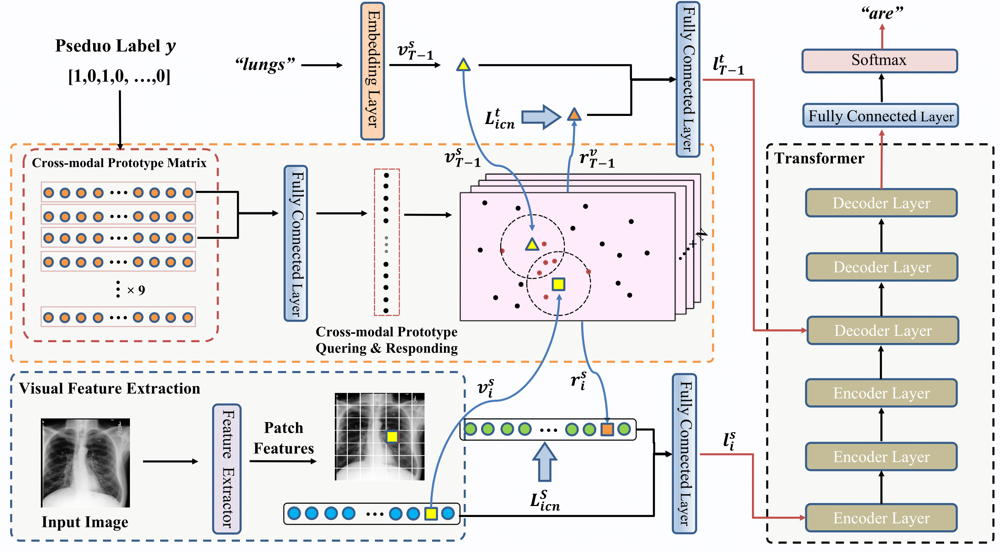

# XProNet

This is the official implementation of [Cross-modal Prototype Driven Network for Radiology Report Generation]() accepted to ECCV2022.

## Abstract

Radiology report generation (RRG) aims to describe auto-
matically a radiology image with human-like language. As an alternative
to expert diagnosis, RRG could potentially support the work of radiol-
ogists, reducing the burden of manual reporting. Previous approaches
often adopt an encoder-decoder architecture and focus on single-modal
feature learning, while few studies explore cross-modal feature inter-
action. Here we propose a Cross-modal PROtotype driven NETwork
(XPRONET) to promote cross-modal pattern learning and exploit it
to improve the task of radiology report generation. This is achieved by
three well-designed, fully differentiable and complementary modules: a
shared cross-modal prototype matrix to record the cross-modal proto-
types; a cross-modal prototype network to learn the cross-modal pro-
totypes and embed the cross-modal information into the visual and
textual features; and an improved multi-label contrastive loss to en-
able and enhance multi-label prototype learning. Experimental results
demonstrate that XPRONET obtains substantial improvements on two
commonly used medical report generation benchmark datasets, i.e., IU-
Xray and MIMIC-CXR, where its performance exceeds recent state-of-
the-art approaches by a large margin on IU-Xray dataset and achieves
the SOTA performance on MIMIC-CXR. 



## Citations

If you use or extend our work, please cite our paper.
```

```

## Prerequisites

The following packages are required to run the scripts:
- [Python >= 3.6]
- [PyTorch = 1.6]
- [Torchvision]
- [Pycocoevalcap]

* You can create the environment via conda:
```bash
conda env create --name [env_name] --file env.yml
```


## Download Trained Models
You can download the trained models [here](https://drive.google.com/drive/folders/1_y_6srL2ZnvDvE_I0YDvdgRzZCNrcMUf?usp=sharing).

## Datasets
We use two datasets (IU X-Ray and MIMIC-CXR) in our paper.

For `IU X-Ray`, you can download the dataset from [here](https://openi.nlm.nih.gov/faq).

For `MIMIC-CXR`, you can download the dataset from [here](https://physionet.org/content/mimic-cxr/2.0.0/).

After downloading the datasets, put them in the directory `data`.

## Pseudo Label Generation
You can generate the pesudo label for each dataset by leveraging the automatic labller [ChexBert](https://github.com/stanfordmlgroup/CheXbert).

We also provide the generated labels in the files directory.

## Cross-modal Prototypes Initialization
The processed cross-modal prototypes are provided in the files directly.
For those who prefer to generate the prototype for initilization by their own, you should:
- Leverage the pretrained visual extractor (imagenet-pretrained) and Bert (ChexBert) to extract the visual and texual features.
- Concat the visual and texual features.
- Utilize K-mean algorithm to cluster to cross-modal features to 14 clusters.

The above procedure is elobarately described in our paper.

## Experiments on IU X-Ray
Our experiments on IU X-Ray were done on a machine with 1x2080Ti.

Run `bash run_iu_xray.sh` to train a model on the IU X-Ray data.

## Run on MIMIC-CXR
Our experiments on MIMIC-CXR were done on a machine with 4x2080Ti.

Run `bash run_mimic_cxr.sh` to train a model on the MIMIC-CXR data.

## Acknowledgment
Our project references the codes in the following repos. Thanks for thier works and sharing.
- [R2GenCMN](https://github.com/cuhksz-nlp/R2GenCMN)
